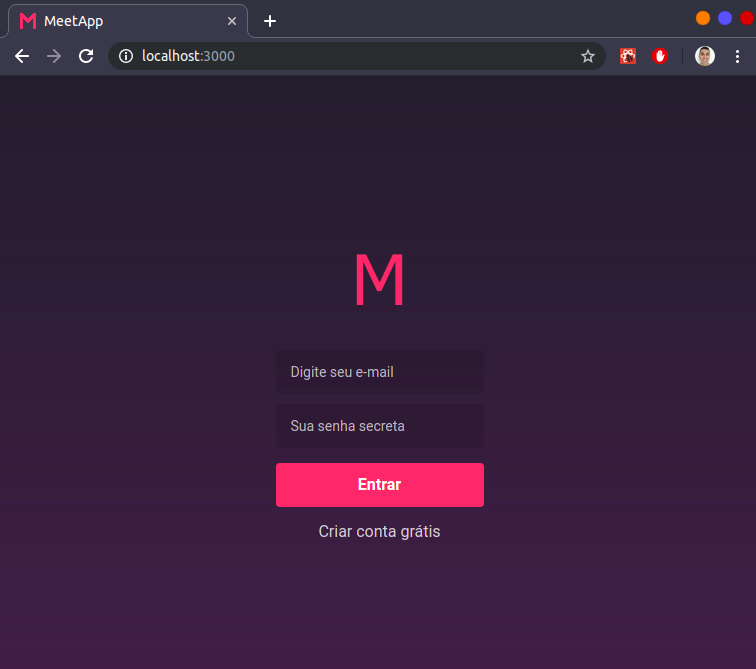
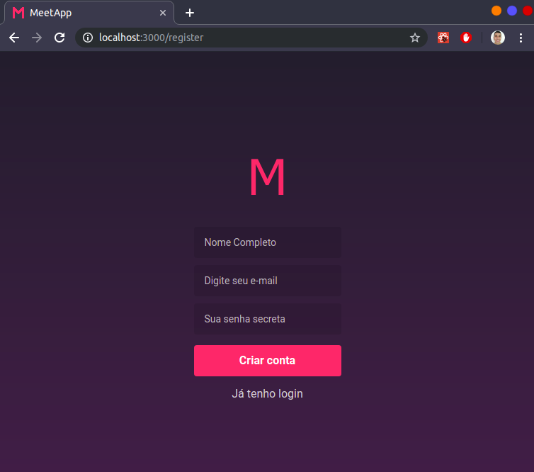
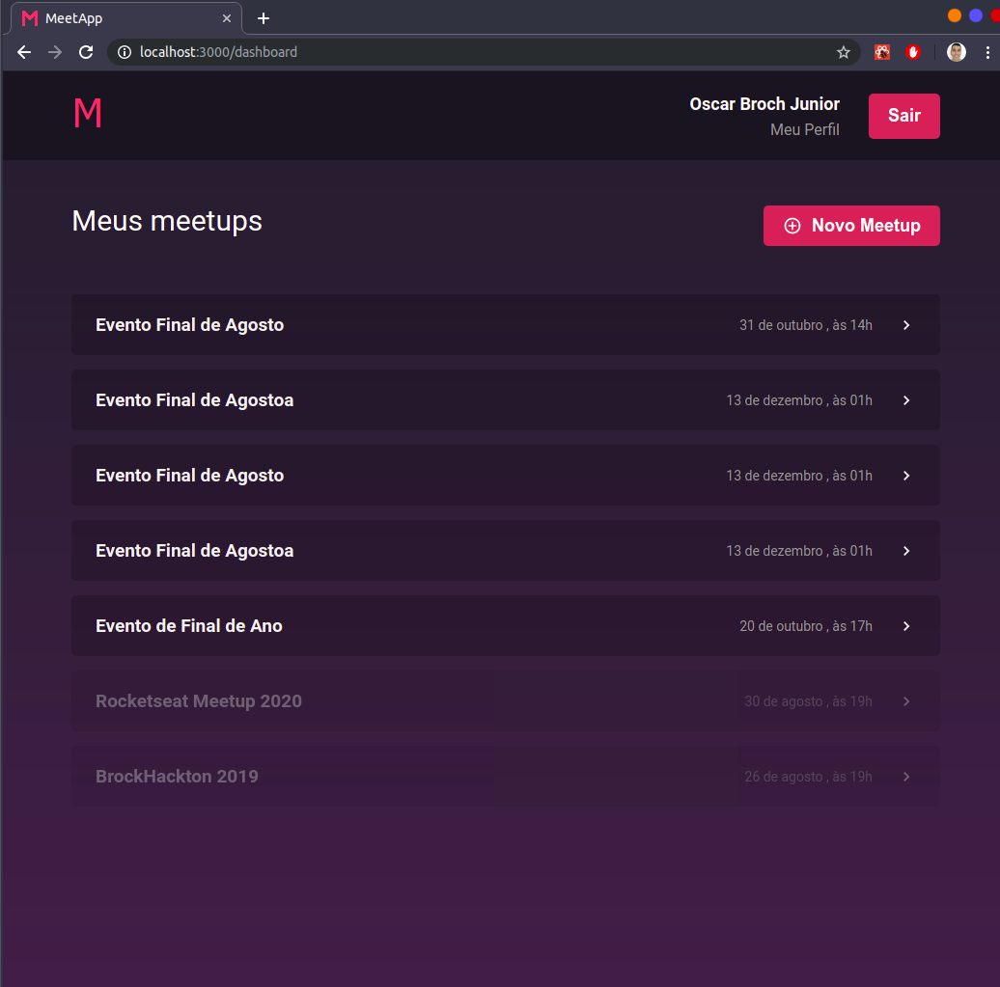
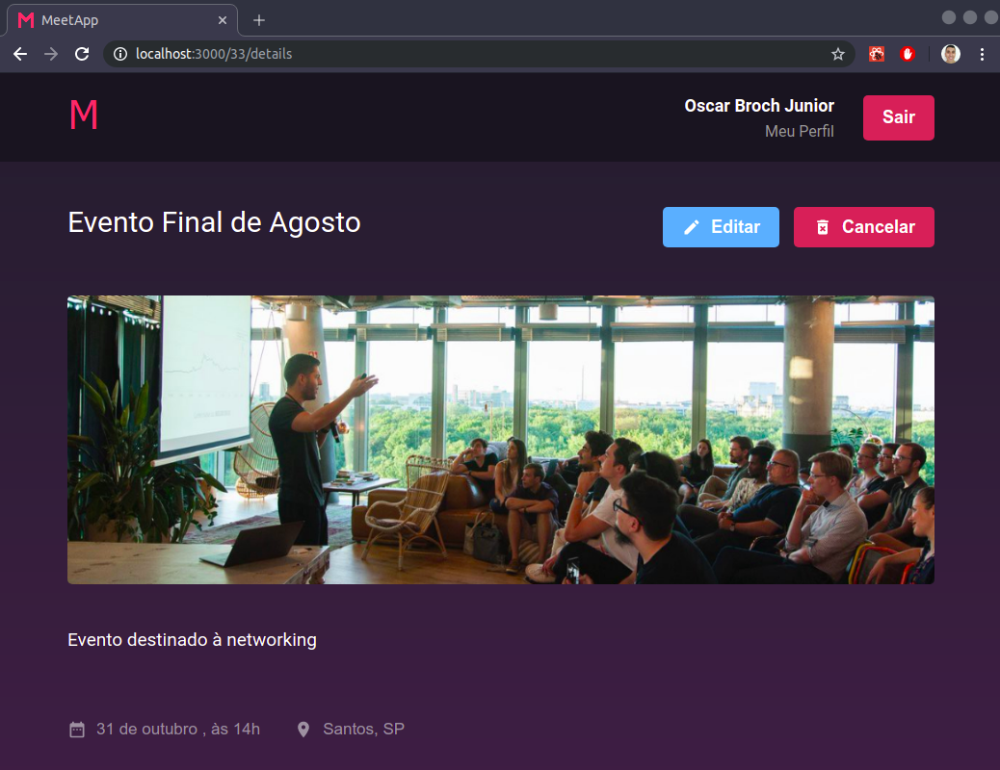
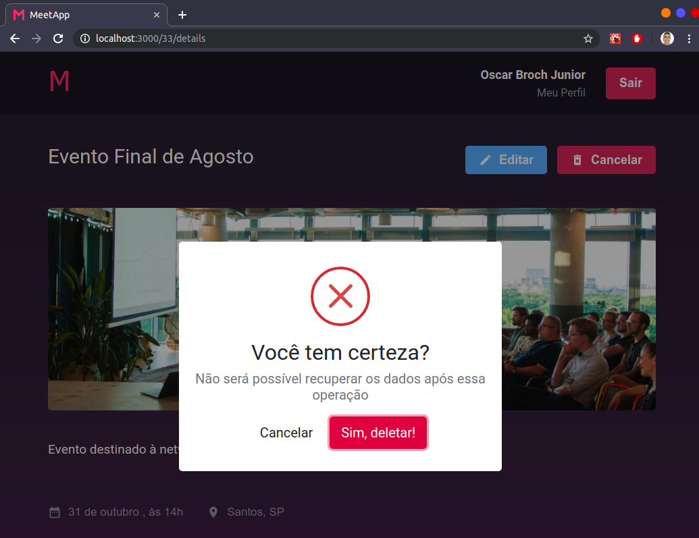
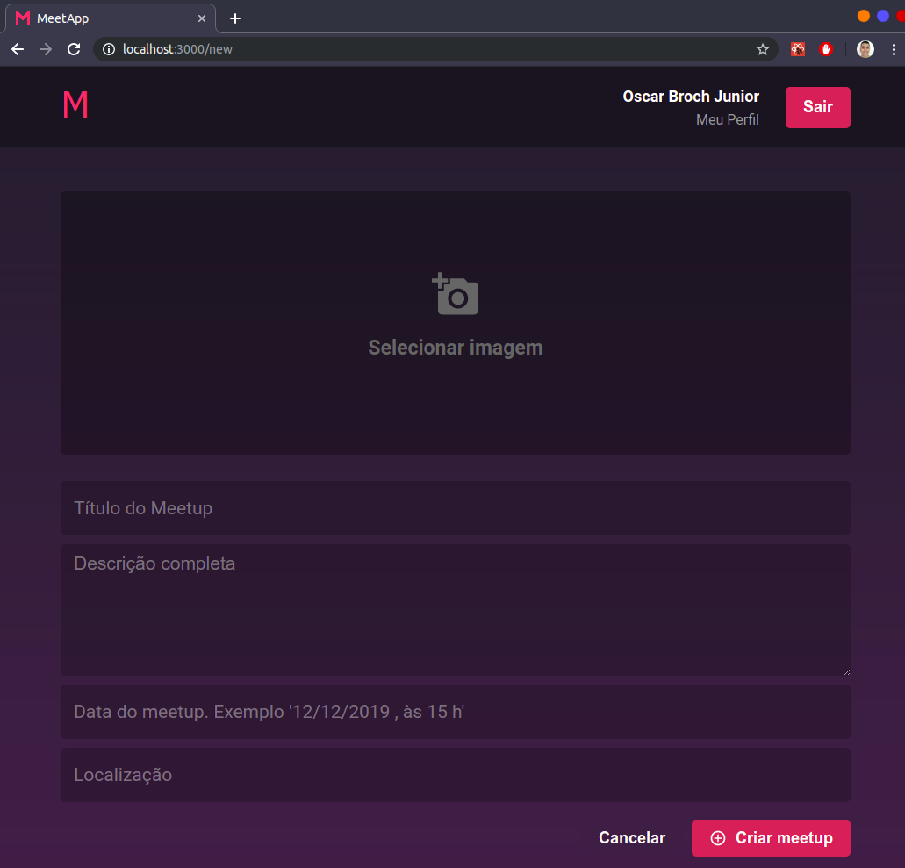
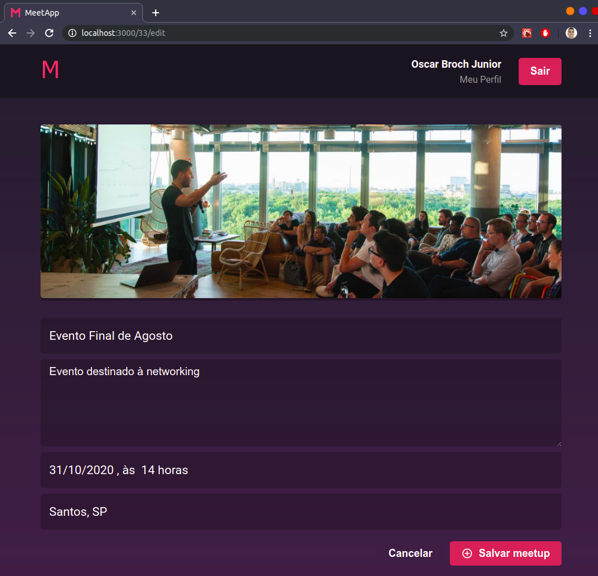
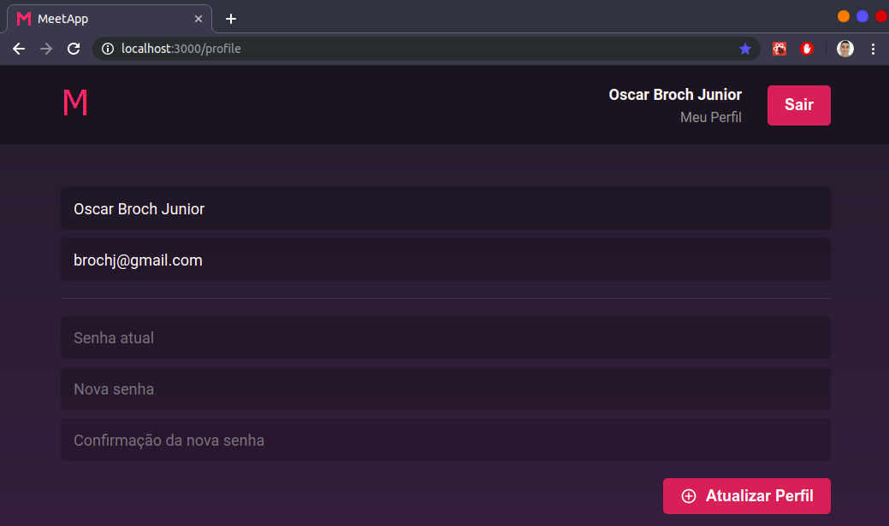

# Desafio 09. Front-end do Meetapp

## Conteúdo
- [Desafio 09. Front-end do Meetapp](#desafio-09-front-end-do-meetapp)
  - [Conteúdo](#conte%c3%bado)
  - [Telas](#telas)
    - [Autenticação](#autentica%c3%a7%c3%a3o)
    - [Cadastro](#cadastro)
    - [Dashboard](#dashboard)
    - [Detalhes](#detalhes)
    - [Novo/editar](#novoeditar)
    - [Perfil](#perfil)

Nesse desafio você irá construir o front-end com ReactJS do Meetapp que utilizará a API que você desenvolveu durante os desafios do segundo e terceiro módulo de Node.js.

- [x] Crie uma aplicação do zero utilizando create-react-app e configure as ferramentas de padrões de código, Reactotron, Redux e Redux Saga.

Essa aplicação será utilizada por organizadores de meetups e não contará com funcionalidades de inscrição.

Essa aplicação faz parte do desafio final do bootcamp utilizado para finalização e certificação.

## Telas

### Autenticação
- [x] O usuário deve poder se autenticar utilizando e-mail e senha.

### Cadastro

- [x] O usuário deve poder se cadastrar com nome, e-mail e senha.

### Dashboard

- [x] O usuário deve poder listar os meetups que organiza e clicar para ver detalhes de um meetup.

- [x] Nessa tela o usuário pode navegar para a página de criação de meetup.

### Detalhes

- [x] O usuário deve poder visualizar detalhes de um meetup previamente cadastrado.

- [x] Nessa tela o usuário pode editar os dados de um meetup ou até cancelar um meetup.

### Novo/editar

- [x] O usuário deve poder cadastrar ou editar informações de meetups que organiza.

- [x] Exiba a preview de imagem de banner do meetup quando o usuário selecionar uma imagem.

- [x] Utilize validação nos campos.

### Perfil

- [x] O usuário deve poder editar suas informações de cadastro.

- [x] Utilize validação nos campos.

